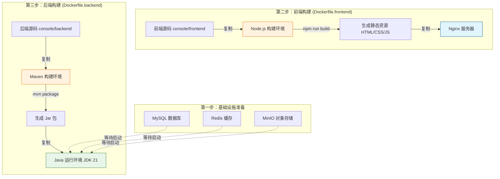

# PaiFlow Docker 部署教程

欢迎来到 PaiFlow 的 Docker 部署指南！

这篇文档主要是为了帮助大家快速上手，把 PaiFlow 这个项目在本地跑起来。我们专门设计了一套“一键启动”的方案，利用 Docker 的能力，帮你屏蔽掉繁琐的环境配置问题。不管你用的是 Windows、Mac 还是 Linux，只要你的电脑上装了 Docker，就能轻松搞定。

## 准备工作

在开始之前，请确保你的电脑上已经安装了下面这两个工具：

1.  **Docker Engine** (推荐 20.10 及以上版本)
2.  **Docker Compose** (推荐 2.0 及以上版本)

你**不需要**在本地安装 Java、Maven 或者 Node.js 环境。所有的编译和运行工作，都会在 Docker 容器里自动完成，保持你本地环境的整洁。

---

## 它是怎么工作的？

为了让你对整个过程有个清晰的认识，我们画了一张图来解释 Docker 是怎么把代码变成可运行的服务的。

我们采用了一种叫做**“多阶段构建”**的技术。你可以把它想象成“厨房”和“餐厅”的关系：我们在一个装满工具的“厨房容器”里把代码做成“菜”（编译成 Jar 包或静态文件），然后把“菜”端到一个干净清爽的“餐厅容器”里运行。这样做出来的镜像非常小，运行效率也高。

为了解决国内网络环境下载镜像慢的问题，我们默认配置了 **DaoCloud 镜像加速** (`docker.m.daocloud.io`)，确保你能顺畅地拉取基础镜像。



### 深入理解核心文件

#### 1. 总指挥：`docker-compose.yaml`

这个文件定义了整个系统的“编排逻辑”。

```yaml
version: '3.8'

services:
  # -----------------------------------------------------------------------------
  # 1. 基础设施层
  # -----------------------------------------------------------------------------
  
  # MySQL 数据库服务
  mysql:
    image: docker.m.daocloud.io/library/mysql:8.4
    container_name: paiflow-mysql
    environment:
      MYSQL_ROOT_PASSWORD: 123456 # 统一密码
      MYSQL_DATABASE: paiflow-console
    volumes:
      - ./mysql:/docker-entrypoint-initdb.d # 自动初始化 SQL 脚本
    ports:
      - "3306:3306"

  # Redis 缓存服务
  redis:
    image: docker.m.daocloud.io/library/redis:7
    container_name: paiflow-redis

  # MinIO 对象存储服务
  minio:
    image: docker.m.daocloud.io/minio/minio:RELEASE.2025-07-23T15-54-02Z
    ports:
       - "9000:9000"  # API 端口
       - "9001:9001"  # 控制台端口

  # -----------------------------------------------------------------------------
  # 2. 应用层
  # -----------------------------------------------------------------------------

  # 控制台前端 (React + Nginx)
  console-frontend:
    ports:
      - "3000:1881" # 前端访问地址 http://localhost:3000

  # 控制台后端 (Java Spring Boot)
  console-hub:
    environment:
      MYSQL_HOST: mysql
      MYSQL_PASSWORD: 123456
      OSS_REMOTE_ENDPOINT: http://localhost:9000 # 浏览器访问 MinIO 的地址
    ports:
      - "8080:8080"

  # 工作流引擎
  core-workflow-java:
    environment:
      MYSQL_HOST: mysql
      MYSQL_PASSWORD: 123456
    ports:
      - "7880:7880"
```

#### 3. 前端构建 (`Dockerfile.frontend`)

前端构建过程不仅负责编译 React 代码，还配置了一个生产级别的 Nginx 服务器来处理静态资源和 API 代理。

```dockerfile
# -----------------------------------------------------------------------------
# 第一阶段：构建环境 (Builder Stage)
# -----------------------------------------------------------------------------
# 使用 Node.js 18 作为构建基础镜像
FROM docker.m.daocloud.io/library/node:18-alpine AS builder
WORKDIR /app

# 复制前端源代码
COPY console/frontend /app/console/frontend
WORKDIR /app/console/frontend

# 安装依赖并编译
# 1. 设置 npm 镜像源为官方源（也可以换成淘宝源加快速度）
# 2. npm ci: 严格按照 package-lock.json 安装依赖，比 npm install 更快更稳定
# 3. max-old-space-size=4096: 增加 Node 内存限制，防止构建大型项目时内存溢出
RUN npm config set registry https://registry.npmjs.org/ && \
    npm ci --legacy-peer-deps && \
    NODE_OPTIONS="--max-old-space-size=4096" npm run build-prod

# -----------------------------------------------------------------------------
# 第二阶段：运行环境 (Runtime Stage)
# -----------------------------------------------------------------------------
# 使用轻量级的 Nginx Alpine 镜像
FROM docker.m.daocloud.io/library/nginx:1.15-alpine

# 定义环境变量，Nginx 将监听此端口 (默认 1881)
ENV NGINX_PORT=1881

# 【核心配置】动态生成 nginx.conf
# 这里直接在 Dockerfile 里写入配置，免去了挂载外部配置文件的麻烦
RUN echo "user  nginx; \
worker_processes  8; \
# ... (省略标准日志和性能配置) ...
http { \
  include       /etc/nginx/mime.types; \
  default_type  application/octet-stream; \
  # 开启 Gzip 压缩，减少传输流量
  gzip on; \
  \
  server { \
    listen ${NGINX_PORT}; \
    root /var/www; \
    \
    # 1. SPA 单页应用路由支持
    # 所有 404 请求都重定向回 index.html，由 React Router 处理路由
    location / { \
      try_files \$uri \$uri/ /index.html; \
      expires -1; \
    } \
    \
    # 2. API 反向代理 (解决跨域问题)
    # 将 /console-api/ 开头的请求转发给后端容器 console-hub
    location /console-api/ { \
      proxy_pass http://console-hub:8080/; \
      proxy_set_header Host \$host; \
      proxy_set_header X-Real-IP \$remote_addr; \
    } \
    \
    # 3. 静态资源长期缓存
    location ~ .*\.(js|css|png|jpg|...)$ { \
      expires 1y; \
    } \
  } \
}" > /etc/nginx/nginx.conf

# 暴露端口
EXPOSE ${NGINX_PORT}

# 从构建阶段复制编译好的 dist 目录到 Nginx 目录
COPY --from=builder /app/console/frontend/dist /var/www

# 启动 Nginx
COPY console/frontend/docker-entrypoint.sh /docker-entrypoint.sh
RUN chmod +x /docker-entrypoint.sh
ENTRYPOINT ["/docker-entrypoint.sh"]
```

**关键点解析：**

1.  **SPA 路由支持 (`try_files`)**：React 是单页应用 (SPA)，如果用户直接访问 `/login` 这样的子路径，Nginx 默认会找 `login` 文件，找不到就报 404。配置 `try_files ... /index.html` 后，Nginx 会把所有找不到的请求都给 `index.html`，让前端路由接管，完美解决刷新 404 问题。
2.  **API 反向代理 (`proxy_pass`)**：这是前后端分离部署的关键。前端代码里请求 `/console-api/xxx`，Nginx 会自动把请求转发给后端的 `http://console-hub:8080/xxx`。这样做有两个好处：
    *   **解决跨域 (CORS)**：浏览器看来所有请求都是发给同一个域名的，不存在跨域问题。
    *   **隐藏后端架构**：外部用户不需要知道后端的真实 IP 和端口。
3.  **内存优化**：构建时增加了 Node.js 的内存上限，防止因项目过大导致构建失败。

---

## 动手试试：一键启动

打开你的终端（Terminal 或 CMD），进入到当前这个 `docker/PaiFlow` 目录，然后执行下面这行命令：

```bash
docker-compose up -d --build
```

### 验证是否成功

当命令执行完毕，且没有报错时，你可以打开浏览器看看效果：

*   **控制台前端**：[http://localhost:3000](http://localhost:3000)
    *   **登录账号**：`admin`
    *   **登录密码**：`123` (注意：这是演示环境的硬编码密码，与数据库密码不同)
*   **控制台后端接口**：[http://localhost:8080/actuator/health](http://localhost:8080/actuator/health)
*   **工作流引擎接口**：[http://localhost:7880/actuator/health](http://localhost:7880/actuator/health)
*   **MinIO 控制台**：[http://localhost:9001](http://localhost:9001)
    *   账号：`minioadmin`
    *   密码：`minioadmin`

### 停止服务

```bash
docker-compose down
```

如果你想把数据库里的数据也清空，重新来过，可以加一个 `-v` 参数：`docker-compose down -v`。

---

## 常见问题解答 (FAQ) & 故障排除

**Q: 启动时提示端口被占用（Port already in use）怎么办？**
A: 请检查本地是否已经运行了 MySQL (3306), Redis (6379) 或 MinIO (9000/9001)。推荐先停止本地冲突的服务，或者使用 `docker stop <container_id>` 停止旧的容器。

**Q: 登录时提示“服务器开小差了” (500 Error) 或 后端日志报错 `RedisException: NOSCRIPT`？**
A: 这是因为 Redis 容器重启后丢失了 Lua 脚本缓存，但后端服务还在尝试调用旧的脚本 SHA 值。
**解决方法**：重启后端服务即可。
```bash
docker compose restart console-hub
```

**Q: 前端登录接口报错 `502 Bad Gateway`？**
A: 这通常发生在后端服务 (`console-hub`) 重启后 IP 地址发生变化，但前端 Nginx 还在缓存旧的 IP。
**解决方法**：重启前端服务。
```bash
docker compose restart console-frontend
```

**Q: 数据库初始化失败 `Variable 'time_zone' can't be set to the value of 'NULL'`？**
A: 这是一个已知的 SQL 脚本兼容性问题。我们在 `schema.sql` 中已经注释掉了相关代码。如果遇到此问题，请确保使用的是最新的代码，并尝试 `docker compose down -v` 清理卷后重试。

**Q: 为什么 MinIO 无法上传/下载文件？**
A: 请检查 `docker-compose.yaml` 中的 `OSS_REMOTE_ENDPOINT` 是否配置为 `http://localhost:9000`。如果配置为容器内部 IP，浏览器将无法访问。
