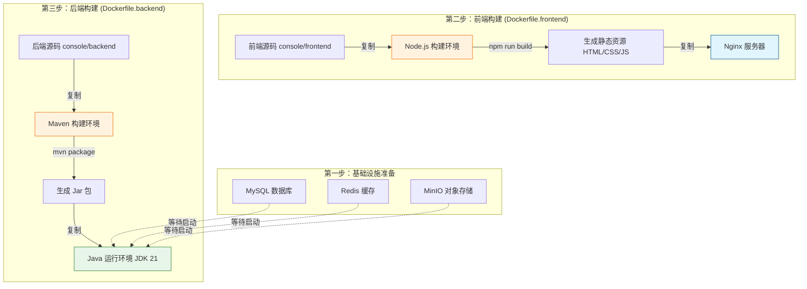

# PaiFlow Docker 部署教程

欢迎来到 PaiFlow 的 Docker 部署指南！

这篇文档主要是为了帮助大家快速上手，把 PaiFlow 这个项目在本地跑起来。我们专门设计了一套“一键启动”的方案，利用 Docker 的能力，帮你屏蔽掉繁琐的环境配置问题。不管你用的是 Windows、Mac 还是 Linux，只要你的电脑上装了 Docker，就能轻松搞定。

## 准备工作

在开始之前，请确保你的电脑上已经安装了下面这两个工具：

1.  **Docker Engine** (推荐 20.10 及以上版本)
2.  **Docker Compose** (推荐 2.0 及以上版本)

你**不需要**在本地安装 Java、Maven 或者 Node.js 环境。所有的编译和运行工作，都会在 Docker 容器里自动完成，保持你本地环境的整洁。

---

## 它是怎么工作的？

为了让你对整个过程有个清晰的认识，我们画了一张图来解释 Docker 是怎么把代码变成可运行的服务的。

我们采用了一种叫做**“多阶段构建”**的技术。你可以把它想象成“厨房”和“餐厅”的关系：我们在一个装满工具的“厨房容器”里把代码做成“菜”（编译成 Jar 包或静态文件），然后把“菜”端到一个干净清爽的“餐厅容器”里运行。这样做出来的镜像非常小，运行效率也高。



### 深入理解核心文件

在这个目录下，有几个关键文件在发挥作用，我们来逐一解读。

#### 1. 总指挥：`docker-compose.yaml`
这个文件是 Docker Compose 的配置文件，它定义了整个系统的“编排逻辑”。你可以把它想象成一个乐团的指挥谱，告诉每个乐手（服务）该什么时候出场，该怎么配合。

```yaml
version: '3.8'  # 使用 Docker Compose 的 3.8 版本语法

services:
  # -----------------------------------------------------------------------------
  # 1. 基础设施层 (Database & Cache & Storage)
  # -----------------------------------------------------------------------------
  
  # MySQL 数据库服务
  mysql:
    image: mysql:8.4               # 使用 MySQL 8.4 官方镜像
    container_name: paiflow-mysql  # 给容器起个固定的名字，方便后续操作
    environment:
      MYSQL_ROOT_PASSWORD: root123 # 设置 root 用户的密码
      MYSQL_DATABASE: paiflow-console # 初始创建的数据库名，对应后端配置
    volumes:
      - mysql_data:/var/lib/mysql  # 【重要】把数据存到 Docker 卷里，防止重启丢失
      - ./mysql:/docker-entrypoint-initdb.d # 【关键】把本地 SQL 脚本挂载进去，自动初始化数据库
    networks:
      - paiflow-network            # 加入专用的虚拟网络
    healthcheck:                   # 健康检查：每 30 秒 ping 一次，确保数据库活着
      test: ["CMD", "mysqladmin", "ping", "-h", "localhost"]

  # Redis 缓存服务
  redis:
    image: redis:7                 # 使用 Redis 7 官方镜像
    container_name: paiflow-redis
    volumes:
      - redis_data:/data           # 持久化 Redis 数据
    networks:
      - paiflow-network

  # MinIO 对象存储服务 (类似 AWS S3)
  minio:
    image: minio/minio:RELEASE.2025-07-23T15-54-02Z
    container_name: paiflow-minio
    environment:
      MINIO_ROOT_USER: minioadmin      # 设置管理员账号
      MINIO_ROOT_PASSWORD: minioadmin123 # 设置管理员密码
    ports:
       - "9000:9000"  # API 端口：映射到宿主机 9000
       - "9001:9001"  # 控制台端口：映射到宿主机 9001
     command: server /data --console-address ":9001" # 启动命令：指定数据目录和控制台地址

  # -----------------------------------------------------------------------------
  # 2. 应用层 (Frontend & Backend)
  # -----------------------------------------------------------------------------

  # 控制台前端 (React + Nginx)
  console-frontend:
    build:
      context: ../../              # 【关键】构建上下文是项目根目录，这样才能访问到源码
      dockerfile: docker/PaiFlow/Dockerfile.frontend # 指定 Dockerfile 位置
    ports:
      - "3000:1881"                # 把容器内的 1881 端口映射到电脑的 3000 端口
    networks:
      - paiflow-network

  # 控制台后端 (Java Spring Boot)
  console-hub:
    build:
      context: ../../
      dockerfile: docker/PaiFlow/Dockerfile.backend
    environment:
      # 告诉后端去哪里连数据库 (使用容器名 'mysql' 作为主机名)
      MYSQL_HOST: mysql            # 连接 MySQL 容器
      MYSQL_PORT: 3306
      MYSQL_DB: paiflow-console    # 指定数据库名
      REDIS_HOST: redis            # 连接 Redis 容器
      OSS_ENDPOINT: http://minio:9000 # 连接 MinIO 容器 (Docker 内部通信用)
      OSS_REMOTE_ENDPOINT: http://localhost:9000 # 浏览器下载文件用 (外部访问用)
      WORKFLOW_CHAT_URL: http://core-workflow-java:7880... # 连接工作流服务
    depends_on:                    # 【关键】启动顺序控制
      mysql:
        condition: service_healthy # 必须等 MySQL 健康检查通过了再启动
      redis:
        condition: service_healthy
      minio:
        condition: service_healthy

  # 工作流引擎 (Java Spring Boot)
  core-workflow-java:
    build:
      context: ../../
      dockerfile: docker/PaiFlow/Dockerfile.workflow
    environment:
      MYSQL_HOST: mysql            # 连接同一个 MySQL
      MODEL_SERVICE_URL: http://console-hub:8080 # 连接控制台后端
    ports:
      - "7880:7880"                # 暴露 7880 端口
    depends_on:
      mysql:
        condition: service_healthy # 同样要等数据库准备好

networks:
  paiflow-network:                 # 定义网络，让大家能互相访问

volumes:                           # 定义数据卷，持久化保存数据
  mysql_data:
  redis_data:
  minio_data:
```

#### 2. 后端构建 (`Dockerfile.backend`)
这是 Java 后端服务的构建过程。

```dockerfile
# 1. 定义“厨房”：使用 Maven 和 JDK 21 的镜像作为构建环境
# 这个镜像标签 (Tag) 包含了丰富的信息：
# - 3.9.9：代表 Maven 的版本是 3.9.9
# - eclipse-temurin-21：代表 JDK 的版本是 21 (来自 Eclipse Temurin 发行版)
# - noble：代表底层的 Linux 操作系统是 Ubuntu 24.04 LTS (代号 Noble Numbat)
# 注意：这些工具是 Docker 从互联网上拉取的，完全独立于你本机的环境。
FROM maven:3.9.9-eclipse-temurin-21-noble AS build
WORKDIR /app

# 2. 把源代码“搬进厨房”
COPY console/backend /app/console/backend

# 3. 开始“做菜”：进入目录并运行 Maven 打包命令
WORKDIR /app/console/backend
# -DskipTests 表示跳过单元测试，加快构建速度
RUN mvn clean package -DskipTests

# 4. 定义“餐厅”：使用轻量级的 JRE 21 镜像作为运行环境
FROM eclipse-temurin:21-jre-noble
WORKDIR /app

# 5. 设置时区为上海时间，避免日志时间错乱
RUN ln -sf /usr/share/zoneinfo/Asia/Shanghai /etc/localtime && \
    echo "Asia/Shanghai" > /etc/timezone

# 6. 把“做好的菜”（Jar 包）从“厨房”端到“餐厅”
COPY --from=build /app/console/backend/hub/target/hub-server.jar /app/hub-server.jar

# 7. 准备日志目录和暴露端口
RUN mkdir -p /app/logs
EXPOSE 8080

# 8. 启动应用：配置 Java 内存参数并运行 Jar 包
ENTRYPOINT ["java", "-XX:MaxRAMPercentage=75.0", "-jar", "/app/hub-server.jar"]
```

#### 3. 前端构建 (`Dockerfile.frontend`)
这是 React 前端页面的构建过程。

```dockerfile
# 1. 定义“厨房”：使用 Node.js 环境
FROM node:18-alpine AS builder
WORKDIR /app

# 2. 复制代码并安装依赖
COPY console/frontend /app/console/frontend
WORKDIR /app/console/frontend
# npm ci 是一种更干净、更快速的安装依赖方式
RUN npm config set registry https://registry.npmjs.org/ && \
    npm ci --legacy-peer-deps && \
    npm run build-prod

# 3. 定义“餐厅”：使用 Nginx 服务器
FROM nginx:1.15-alpine

# 4. 配置 Nginx（省略了部分细节配置）
RUN echo "..." > /etc/nginx/nginx.conf

# 5. 把编译好的静态文件（HTML/CSS/JS）从“厨房”搬到 Nginx 的目录
COPY --from=builder /app/console/frontend/dist /var/www

# 6. 启动 Nginx
ENTRYPOINT ["/docker-entrypoint.sh"]
```

#### 4. 工作流构建 (`Dockerfile.workflow`)
工作流引擎也是 Java 项目，所以它的构建过程和后端几乎一模一样，也是 Maven 编译 -> 复制 Jar 包 -> JRE 运行。

```dockerfile
# 1. Maven 构建环境
FROM maven:3.9.9-eclipse-temurin-21-noble AS build
# ... (复制源码并 mvn package)

# 2. JRE 运行环境
FROM eclipse-temurin:21-jre-noble
# ... (复制 workflow-java.jar)

# 3. 启动应用
ENTRYPOINT ["java", ..., "-jar", "/app/workflow-java.jar"]
```

---

## 动手试试：一键启动

打开你的终端（Terminal 或 CMD），进入到当前这个 `docker/PaiFlow` 目录，然后执行下面这行命令：

```bash
docker-compose up -d --build
```

### 这个命令到底干了什么？

当你敲下回车后，Docker 会忙活好一阵子，具体流程是这样的：

1.  **下载基础镜像**：如果你本地没有 `maven`、`node`、`mysql` 等镜像，Docker 会先去互联网下载它们。
2.  **构建前端**：它会读取 `Dockerfile.frontend`，启动一个临时的 Node.js 容器，把 React 代码编译成 HTML 和 JS 文件。
3.  **构建后端**：同时，它会读取 `Dockerfile.backend`，启动一个临时的 Maven 容器，下载 Java 依赖包（这一步取决于网速，可能需要几分钟），然后把代码编译成 `.jar` 文件。
4.  **启动数据库**：构建完成后，Docker 会先启动 MySQL、Redis 和 MinIO，并等待它们初始化完成。
5.  **启动应用**：最后，它会启动前端 Nginx 和后端 Java 应用。后端应用会自动连接到已经准备好的 MySQL、Redis 和 MinIO。

> **温馨提示**：第一次运行时，因为要下载大量的 Maven 依赖（Jar 包）和 NPM 依赖，可能需要 5-10 分钟，请耐心喝杯咖啡等待一下。之后的运行就会非常快了。

### 验证是否成功

当命令执行完毕，且没有报错时，你可以打开浏览器看看效果：

*   **想看界面？** 访问前端：[http://localhost:3000](http://localhost:3000)
*   **想看接口？** 访问后端：[http://localhost:8080](http://localhost:8080)
*   **想看工作流？** 访问引擎：[http://localhost:7880](http://localhost:7880)
*   **想看文件存储？** 访问 MinIO：[http://localhost:9001](http://localhost:9001)
    *   账号：`minioadmin`
    *   密码：`minioadmin123`
    *   API 端口：`9000` (代码连接使用)

如果能看到画面，恭喜你，部署成功了！

### 停止服务

玩够了想关闭？在终端里运行：

```bash
docker-compose down
```

如果你想把数据库里的数据也清空，重新来过，可以加一个 `-v` 参数：`docker-compose down -v`。

---

## 常见问题解答 (FAQ)

**Q: 启动时提示端口被占用（Port already in use）怎么办？**

A: 这通常是因为你本地已经运行了 MySQL (3306) 或者 Redis (6379)。
*   **方法一（推荐）**：关掉你本地冲突的服务。
*   **方法二**：打开 `docker-compose.yaml`，找到冲突的服务，修改 `ports` 部分。
*   **注意**：MinIO 默认使用 `9000` (API) 和 `9001` (控制台)，如果冲突也需要修改。

**Q: 数据库名为什么是 `paiflow-console`？**

A: 我们在 `docker-compose.yaml` 里把 MySQL 的默认数据库设置成了 `paiflow-console`。这是为了配合后端代码里的配置。如果随意修改名字，后端程序启动时找不到对应的数据库就会报错。

**Q: 第一次运行数据库是空的吗？**

A: **不是的**。我们已经为您准备好了数据库初始化脚本，它们位于 `docker/PaiFlow/mysql/` 目录下。
当您第一次运行 `docker-compose up` 时，MySQL 容器会自动执行这些 SQL 脚本，创建所有必要的表结构和初始数据。
所以您不需要手动做任何事情。

**Q: 我怎么确认这些 SQL 文件已经被执行了呢？**

A: 您可以通过以下步骤来验证：
1.  进入 MySQL 容器：`docker exec -it paiflow-mysql bash`
2.  登录 MySQL：`mysql -u root -proot123`
3.  查看数据库列表：`SHOW DATABASES;` (您应该能看到 `paiflow_console`, `paiflow-workflow` 等数据库)
4.  查看表结构：`USE paiflow_console; SHOW TABLES;` (您应该能看到许多已经创建好的表)
