# PaiFlow 企业级发布方案

## 目标

把当前项目从“服务器本地构建”升级成一套更像企业环境的流程：

- 代码放在 GitHub
- GitHub Actions 构建镜像
- 镜像推送到 GHCR
- DigitalOcean 服务器只负责拉镜像和重启服务

## 流程图

```mermaid
flowchart LR
    A["本地开发"] --> B["push 到 GitHub"]
    B --> C["GitHub Actions 构建镜像"]
    C --> D["GHCR 镜像仓库"]
    D --> E["手动触发生产部署 workflow"]
    E --> F["SSH 到 DigitalOcean"]
    F --> G["deploy-ghcr.sh"]
    G --> H["docker compose pull"]
    H --> I["docker compose up -d"]
    I --> J["线上服务更新"]
```



## 本次新增的核心文件

- 生产 compose: [docker-compose.prod.yaml](/E:/Project/PaiFlow/docker/PaiFlow/docker-compose.prod.yaml)
- 生产环境样例: [.env.prod.example](/E:/Project/PaiFlow/docker/PaiFlow/.env.prod.example)
- 服务器部署脚本: [deploy-ghcr.sh](/E:/Project/PaiFlow/scripts/server/deploy-ghcr.sh)
- 镜像构建 workflow: [ghcr-build-images.yml](/E:/Project/PaiFlow/.github/workflows/ghcr-build-images.yml)
- 生产部署 workflow: [deploy-production.yml](/E:/Project/PaiFlow/.github/workflows/deploy-production.yml)

## GitHub Secrets

在 GitHub 仓库里至少配置这些 Secrets：

- `DO_HOST`
  线上主机 IP，例如 `146.190.97.62`
- `DO_USER`
  SSH 用户，例如 `xuehang`
- `DO_SSH_KEY`
  DigitalOcean 机器对应的私钥全文
- `GHCR_USERNAME`
  用于服务器拉取 GHCR 镜像的 GitHub 用户名
- `GHCR_TOKEN`
  具有 `read:packages` 权限的 GitHub Token

## 服务器准备

线上机保留已有的 `/opt/PaiFlow/docker/PaiFlow/.env`，里面放业务配置和密钥。

第一次切换到 GHCR 方案前，需要把生产 compose 放到服务器：

```bash
scp docker/PaiFlow/docker-compose.prod.yaml xuehang@146.190.97.62:/opt/PaiFlow/docker/PaiFlow/
scp scripts/server/deploy-ghcr.sh xuehang@146.190.97.62:/opt/PaiFlow/scripts/server/
chmod +x /opt/PaiFlow/scripts/server/deploy-ghcr.sh
```

## 发布方式

### 1. 构建镜像

推送到 `main` 后，GitHub Actions 会自动构建并推送这些镜像：

- `ghcr.io/<owner>/paiflow-console-frontend`
- `ghcr.io/<owner>/paiflow-console-hub`
- `ghcr.io/<owner>/paiflow-core-workflow-java`
- `ghcr.io/<owner>/paiflow-core-aitools`

标签默认会有：

- `latest`
- `sha-<commit>`
- `tag` 触发时的版本标签

### 2. 部署生产

在 GitHub Actions 手动触发 `Deploy Production`：

- `image_tag`: 例如 `latest` 或 `sha-abcdef1`
- `services`: 例如 `core-workflow-java`、`console-hub,core-workflow-java` 或 `all`

## 推荐实践

### 日常迭代

1. 新建功能分支
2. 提交代码并 push
3. 发起 PR
4. 合并到 `main`
5. 等待镜像构建完成
6. 手动触发生产部署

## 现在的默认原则

生产机不再承担应用构建任务。

- GitHub Actions 负责构建镜像
- GHCR 负责保存镜像
- 服务器只负责：
  - `docker login`
  - `docker compose pull`
  - `docker compose up -d --wait`

这样可以避免：

- Java 或前端本地构建把生产机 CPU、内存、磁盘 I/O 打满
- SSH 在构建窗口里变得不稳定
- “代码已经同步但服务还在本地编译”这种半完成状态

## 部署脚本行为

[deploy-ghcr.sh](/E:/Project/PaiFlow/scripts/server/deploy-ghcr.sh) 现在会：

1. 校验 `.env`、`docker-compose.prod.yaml`、GHCR 凭证、镜像前缀和 tag
2. 只拉取目标服务镜像
3. 执行 `docker compose up -d --wait`
4. 如果某个服务进入 `unhealthy`，自动输出该容器最近日志并失败退出

## 健康检查

[docker-compose.prod.yaml](/E:/Project/PaiFlow/docker/PaiFlow/docker-compose.prod.yaml) 现在给这些服务补了健康检查：

- `console-frontend`
- `console-hub`
- `core-workflow-java`
- `core-aitools`

这意味着生产部署不再只看“容器启动了没有”，而是会显式等待服务进入可用状态。

### 回滚

如果新版本有问题，不改代码，直接在 `Deploy Production` 里把 `image_tag` 改成旧的 `sha-xxxx` 即可回滚。

## 和你当前方式的区别

旧方式：

- 服务器本地拿代码
- 服务器本地 build
- 本地上传目录或 Git 直推服务器

新方式：

- GitHub 托管代码
- GitHub Actions build
- GHCR 存镜像
- 服务器只 pull 和 up

这就是更接近企业环境的关键差别。
